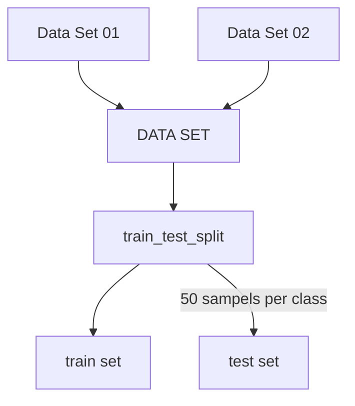

```mermaid
flowchart TD
    data01[Data Set 01]
    data02[Data Set 02]
    data[DATA SET]
    train_set[train set]
    test_set[test set]

    data01 --> data
    data02 --> data
    data --> train_test_split
    train_test_split --> train_set
    train_test_split --50 sampels per class --> test_set
```
