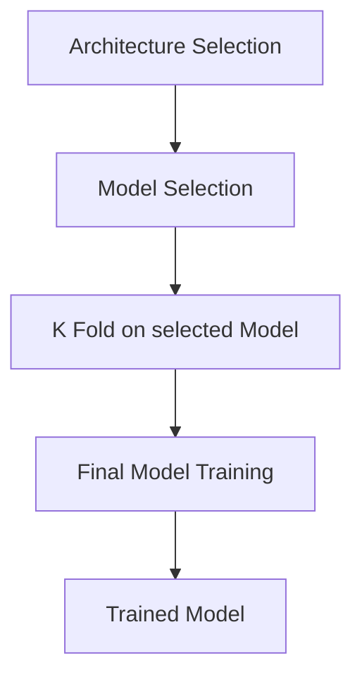
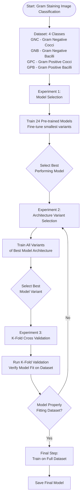

# Higl level diagram

```mermaid
flowchart TD
    as[Architecture Selection]
    ms[Model Selection]
    kf[K Fold on selected Model]
    mt[Final Model Training]
    as --> ms --> kf --> mt --> tm[Trained Model]
```

---

# Detail diagram

```mermaid
flowchart TD
    Start([Start: Gram Staining Image Classification]) --> Dataset[Dataset: 4 Classes<br/>GNC - Gram Negative Cocci<br/>GNB - Gram Negative Bacilli<br/>GPC - Gram Positive Cocci<br/>GPB - Gram Positive Bacilli]

    Dataset --> Exp1[Experiment 1:<br/>Model Selection]
    Exp1 --> Models[Train 24 Pre-trained Models<br/>Fine-tune smallest variants]
    Models --> Best1{Select Best<br/>Performing Model}

    Best1 --> Exp2[Experiment 2:<br/>Architecture Variant Selection]
    Exp2 --> Variants[Train All Variants<br/>of Best Model Architecture]
    Variants --> Best2{Select Best<br/>Model Variant}

    Best2 --> Exp3[Experiment 3:<br/>K-Fold Cross Validation]
    Exp3 --> KFold[Run K-Fold Validation<br/>Verify Model Fit on Dataset]
    KFold --> Validate{Model Properly<br/>Fitting Dataset?}

    Validate -->|Yes| Final[Final Step:<br/>Train on Full Dataset]
    Validate -->|No| Exp2

    Final --> Save[Save Final Model]
```
