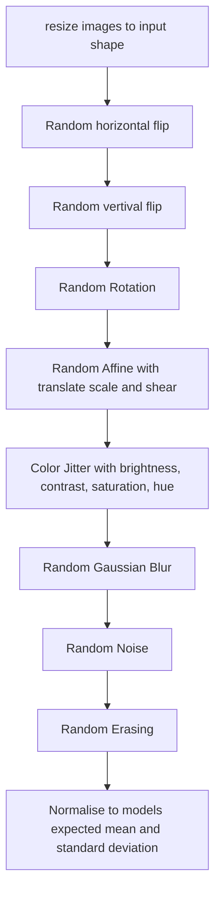

#image-classification #computer-vision #augmentation #ml #workflow #mermaid

```mermaid
flowchart TD
    resize[resize images to input shape]
    HF[Random horizontal flip]
    VF[Random vertival flip]
    RR[Random Rotation]
    RF[Random Affine with translate scale and shear]
    CJ[Color Jitter with brightness, contrast, saturation, hue]
    GB[Random Gaussian Blur]
    RN[Random Noise]
    norm[Normalise to models expected mean and standard deviation]
    RE[Random Erasing]
    resize --> HF --> VF --> RR --> RF --> CJ --> GB --> RN --> RE --> norm
```
