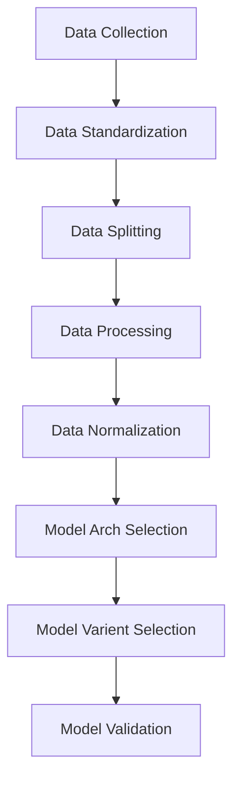

# Pipeline Overview

```mermaid
flowchart TD
    A[Data Collection] --> B[Data Standardization]
    B --> C[Data Splitting]
    C --> D[Data Processing]
    D --> E[Data Normalization]
    E --> F[Model Arch Selection]
    F --> G[Model Varient Selection]
    G --> H[Model Validation]
```
