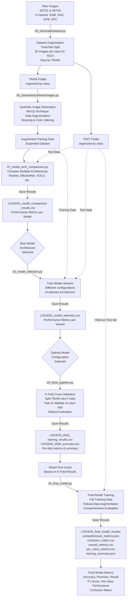

# Gram Staining Classification Pipeline

## Workflow Overview

## Pipeline Stages

### 1. Dataset Generation (00_GenerateDataset.py)

- Collects images from SET01 and SET02 source folders
- Organizes images into 4 classes: GNB, GNC, GPB, GPC
- Creates TRAIN and TEST folders
- Randomly selects 30 images per class for TEST set
- Remaining images go to TRAIN set

### 2. Synthetic Image Generation (00_GenerateSyntheticImages.py)

- Augments training dataset using MixUp technique
- Blends pairs of images to create new synthetic images
- Applies random flipping and color jittering
- Resizes output images to specified dimensions (default 300x300)
- Expands training dataset for better model generalization

### 3. Model Architecture Comparison (01_model_arch_comparision.py)

- Trains and evaluates multiple deep learning architectures
- Models compared: ResNet, EfficientNet, VOLO, etc.
- Evaluates on both augmented training and test data
- Logs performance metrics (accuracy, precision, recall, F1-score)
- Results saved to `LOGS/01_model_comparision_results.csv`
- Identifies best-performing architecture

### 4. Model Variant Selection (02_model_selection.py)

- Tests different configurations of the selected best architecture
- Trains and validates model variants on combined dataset
- Compares performance across variants
- Logs detailed metrics for each variant
- Results saved to `LOGS/02_model_selection.csv`
- Selects optimal model configuration

### 5. K-Fold Cross-Validation (03_kfold_pipeline.py)

- Performs k-fold cross-validation for robust evaluation
- Splits training data into k folds
- Trains model on k-1 folds, validates on 1 fold
- Repeats for all folds to ensure unbiased evaluation
- Logs per-fold metrics and overall summary
- Results saved to:
    - `LOGS/03_kfold_training_results.csv` (per-fold details)
    - `LOGS/03_kfold_summary.csv` (aggregated metrics)
- Model fine-tuned based on k-fold insights

### 6. Final Model Training & Evaluation (04_final_model.py)

- Trains final model on full training dataset
- Applies robust data augmentation during training
- Evaluates on held-out test set
- Generates comprehensive metrics and analysis
- Results saved to `LOGS/04_final_model_results/`:
    - `comprehensive_metrics.json` - Full metric details
    - `confusion_matrix.csv` - Class-wise confusion matrix
    - `overall_metrics.csv` - Overall performance metrics
    - `per_class_metrics.csv` - Per-class precision, recall, F1-score
    - `training_summary.json` - Training history and summary
- Final metrics include accuracy, precision, recall, F1-score, and per-class performance

## Key Concepts

- **Train/Test Split**: 30 images per class reserved for testing; remainder used for training
- **Data Augmentation**: MixUp technique creates synthetic variations to improve model robustness
- **Model Comparison**: Multiple architectures tested to identify best performing model
- **K-Fold Cross-Validation**: Ensures reliable model evaluation and prevents overfitting
- **Comprehensive Evaluation**: Final model assessed with multiple metrics including confusion matrix and per-class performance
